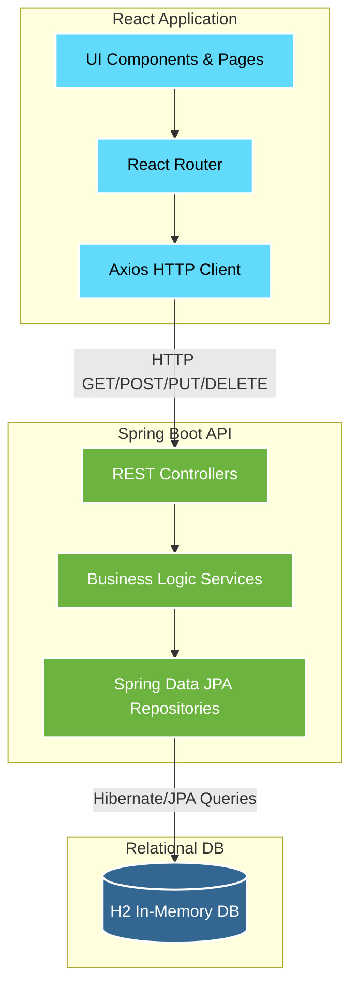

# 🌍 Traveloop - The Future of Personalized Travel Planning


> **Hackathon Submission 2026** - *Empowering users to dream, design, and organize trips with ease.*

Traveloop is a personalized, intelligent, and collaborative platform that transforms the way individuals plan and experience travel. Built as a fully functional MVP for the 2026 Hackathon, Traveloop offers an end-to-end travel planning tool featuring flexible itineraries, automated budget tracking, dynamic packing checklists, and a community hub.

---

## ✨ Key Features (14 Custom UI Modules)

1. **Intelligent Dashboard**: View and manage all upcoming journeys.
2. **Dynamic Itinerary Builder**: Add multiple city stops with chronological flow.
3. **Activity Management**: Log daily sightseeing, food, and transit activities with exact costs.
4. **Automated Budget Tracking**: Visual progress bars mapping expenses to budget limits.
5. **Expense Invoicing**: Professional line-item billing table for trip expenses.
6. **Smart Packing Checklist**: Categorized packing with visual completion progress.
7. **Trip Journaling (Notes)**: Date-stamped notes for hotel details or personal memories.
8. **Community Hub**: Browse and gain inspiration from public itineraries.
9. **Admin Platform**: High-level platform statistics and user monitoring.
10. **Premium UI/UX**: Built with standard React + Tailwind CSS v4 featuring micro-animations, glassmorphism, and a modern color palette.

---

## 🏗️ System Architecture

Traveloop was built using a robust, highly scalable Full-Stack architecture:

- **Frontend**: React (Vite), React Router DOM, TailwindCSS v4, Lucide React (Icons), Axios
- **Backend**: Java 17, Spring Boot, Spring Data JPA, Hibernate, RESTful APIs
- **Database**: H2 In-Memory Database (for seamless hackathon demonstration) / MySQL ready

### Architecture Diagram



---

## 🚀 How to Run Locally

Because Traveloop is configured with an **H2 In-Memory Database**, setup is completely frictionless. You do not need to install MySQL or configure any external services!

### 1. Start the Backend API
Open a terminal and navigate to the `backend` folder:
```bash
cd backend
./mvnw spring-boot:run
```
*The Spring Boot server will start on `http://localhost:8080`, and the database schema will be automatically generated.*

### 2. Start the Frontend UI
Open a separate terminal and navigate to the `frontend` folder:
```bash
cd frontend
npm install
npm run dev
```
*The React app will launch on `http://localhost:5173`.*

---

## 📂 Project Structure

```text
Traveloop/
├── backend/                  # Spring Boot API
│   ├── src/main/java/.../controllers/  # REST endpoints (TripController, UserController)
│   ├── src/main/java/.../services/     # Business logic
│   ├── src/main/java/.../models/       # JPA Entities (Trip, Stop, Activity, ChecklistItem)
│   └── src/main/resources/application.properties  # H2 DB config
│
└── frontend/                 # React UI
    ├── src/pages/            # All 14 UI screens (Dashboard, Budget, Checklist, etc.)
    ├── src/App.jsx           # React Router configuration
    └── src/index.css         # Tailwind v4 imports
```

---

## 💡 The Vision

Traveloop envisions a world where users can explore global destinations, visualize their journeys through structured itineraries, make cost-effective decisions, and share their travel plans within a community—making travel planning as exciting as the trip itself.