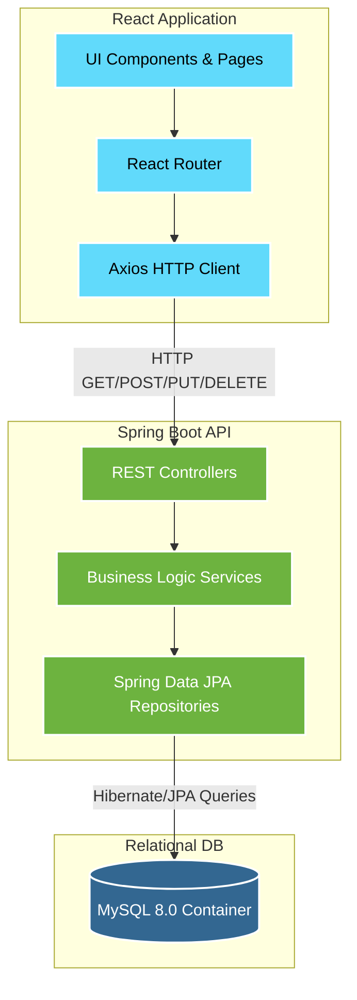

# 🌍 Traveloop - The Future of Personalized Travel Planning


> **Hackathon Submission 2026** - *Empowering users to dream, design, and organize trips with ease.*

Traveloop is a personalized, intelligent, and collaborative platform that transforms the way individuals plan and experience travel. Built as a fully functional MVP for the 2026 Hackathon, Traveloop offers an end-to-end travel planning tool featuring flexible itineraries, automated budget tracking, dynamic packing checklists, and a community hub.

---

## ✨ Key Features (14 Custom UI Modules)

1. **Intelligent Dashboard**: View and manage all upcoming journeys.
2. **Dynamic Itinerary Builder**: Add multiple city stops with chronological flow.
3. **Activity Management**: Log daily sightseeing, food, and transit activities with exact costs.
4. **Automated Budget Tracking**: Visual progress bars mapping expenses to budget limits.
5. **Expense Invoicing**: Professional line-item billing table for trip expenses.
6. **Smart Packing Checklist**: Categorized packing with visual completion progress.
7. **Trip Journaling (Notes)**: Date-stamped notes for hotel details or personal memories.
8. **Community Hub**: Browse and gain inspiration from public itineraries.
9. **Admin Platform**: High-level platform statistics and user monitoring.
10. **Premium UI/UX**: Built with standard React + Tailwind CSS v4 featuring micro-animations, glassmorphism, and a modern color palette.

---

## 🏗️ System Architecture

Traveloop was built using a robust, highly scalable Full-Stack architecture:

- **Frontend**: React (Vite), React Router DOM, TailwindCSS v4, Lucide React (Icons), Axios
- **Backend**: Java 17, Spring Boot, Spring Data JPA, Hibernate, RESTful APIs
- **Database**: MySQL 8.0 (Persistent volume)
- **DevOps**: Docker, Kubernetes, GitHub Actions (CI/CD), Prometheus, Grafana

### Architecture Diagram



---

## 🚀 How to Run Locally (Docker)

Traveloop is fully containerized. The easiest way to run the entire stack (Frontend, Backend, Database, and Monitoring) is using Docker and the provided `Makefile`.

### Prerequisites
- Docker & Docker Compose
- `make` (optional, but recommended)

### 1. Set up Environment Variables
Copy the example environment file:
```bash
cp .env.example .env
```

### 2. Start the Application
Run the following command at the root of the project:
```bash
make up
# Or if you don't have make: docker-compose up -d
```

### 3. Access the Services
Once running, you can access the different components at:
- **Frontend UI**: `http://localhost:5173`
- **Backend API**: `http://localhost:8080`
- **Prometheus**: `http://localhost:9090`
- **Grafana**: `http://localhost:3000` (Login: `admin` / `admin`)

To stop the services, run `make down`. To view logs, run `make logs`.

*(Note: You can still run the project manually using `./mvnw spring-boot:run` in the backend and `npm run dev` in the frontend if you have a local MySQL instance running).*

---

## 🛠️ DevOps & Infrastructure

Traveloop is ready for enterprise-grade deployment:

- **CI/CD Pipeline**: Configured with GitHub Actions (`.github/workflows/ci.yml`) to automatically lint the frontend, run backend tests, and build Docker images on every push.
- **Kubernetes Manifests**: Located in the `k8s/` directory. Includes Deployments, Services, PVCs, and Secrets for the entire stack.
- **Observability**: Fully integrated with Spring Boot Actuator, Prometheus, and Grafana for real-time application metrics.

---

## 📂 Project Structure

```text
Traveloop/
├── backend/                  # Spring Boot API & Dockerfile
├── frontend/                 # React UI & Dockerfile
├── k8s/                      # Kubernetes Manifests
├── prometheus/               # Observability configs
├── .github/workflows/        # CI/CD Pipeline
├── docker-compose.yml        # Local orchestration
├── Makefile                  # Developer scripts
└── README.md                 # You are here!
```

---

## 💡 The Vision

Traveloop envisions a world where users can explore global destinations, visualize their journeys through structured itineraries, make cost-effective decisions, and share their travel plans within a community—making travel planning as exciting as the trip itself.